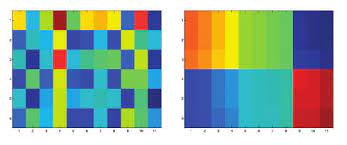

# BiTM:  Biclustering using Topological Maps

This repository contains the Scala / Spark source code that implements a new biclustering approach named BiTM based on self-organizing maps (SOM)

This bitmap coclustering algorithm uses the MapReduce technique to improve processing efficiency.
 
 * Map functions are usually used to extract useful information from a portion of the data.

 * Reduce functions are typically used to aggregate the data output by the Map function.

 Map and Reduce can be executed independently on all machines in the cluster simultaneously.

The algorithm iterates over four main steps:

 1. Assignment of observations
 2. Update of prototypes.
 3. Assignment of variables.
 4. Update of prototypes.

The obtained results depend on the `NEIGHBORHOOD` function and the function controlling T. We use the function below to define the neighborhood:


 $K^T ( \sigma (c_r ,c_s))= e^\frac{- \sigma (c_r ,c_s) }{T}$

where T represents the temperature which decreases based on two predefined values Tmax and Tmin, in order to control the size of the neighborhood influencing a given cell on the map.

This allows for the reorganization of our data as follows:




## Dataset
The dataset used to run the algorithm is Waveform-5000_arff Database Generator generating 3 classes of waves. Each class is generated from a combination of 2 of 3
  1. Downloaded from : https://datahub.io/machine-learning/waveform-5000

## Quick start
 - This version of maven is compatible with Java 8.
 - The version of scala used is : 2.12
 - The version of spark used is : 2.4.3


Make sure that maven is using the correct version of java:

```
export JAVA_HOME=/usr/lib/jvm/java-8-openjdk-amd64/
```

You can compile the script as follows:
```
./build.sh
```
You can run the script as follows:
```
./run.sh
```
